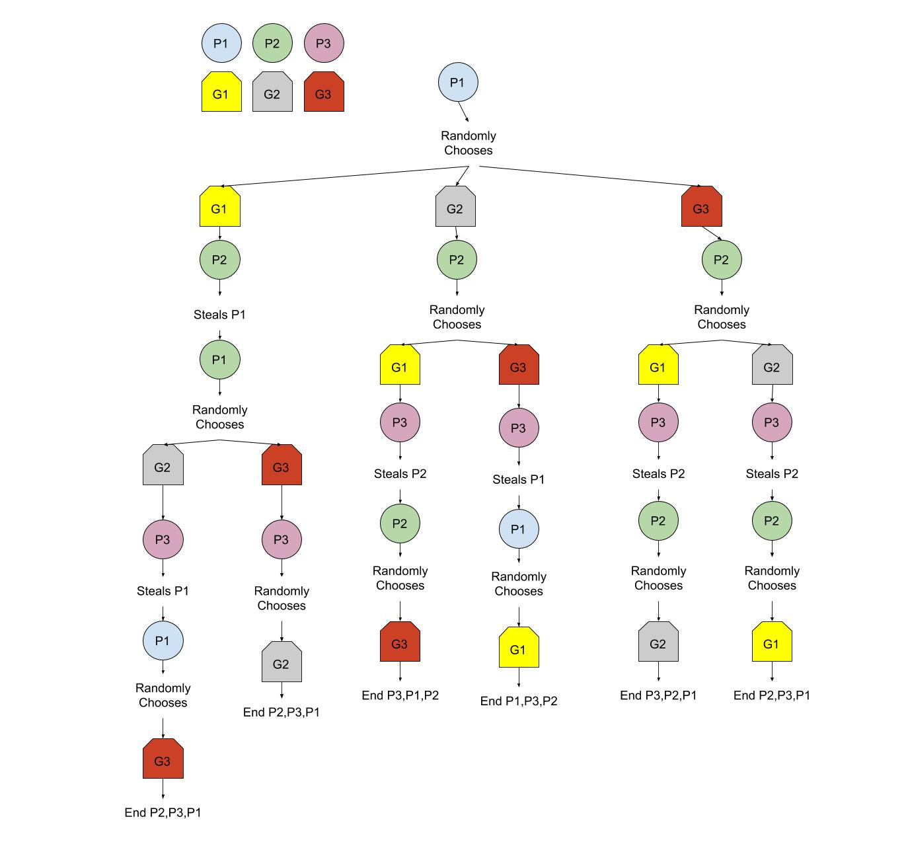
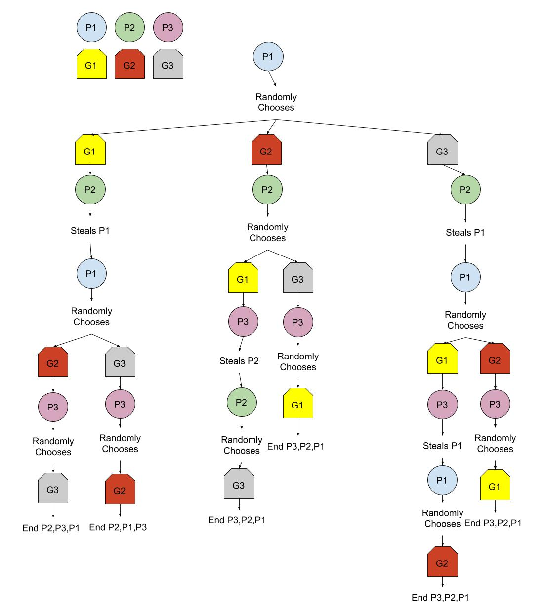
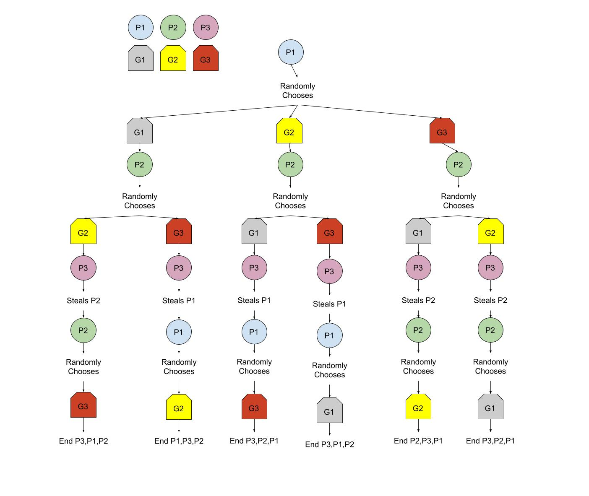
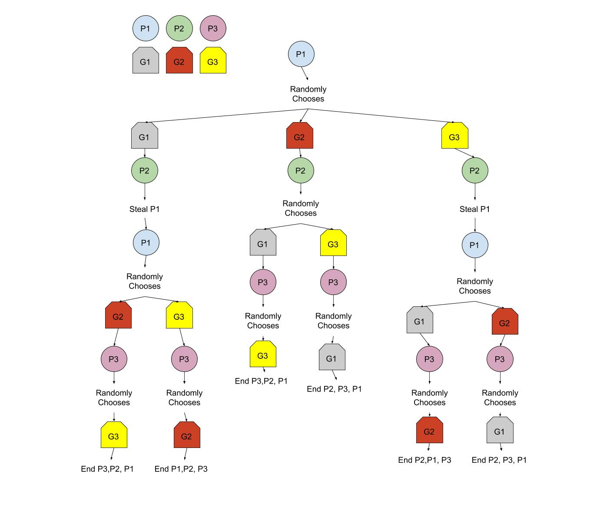
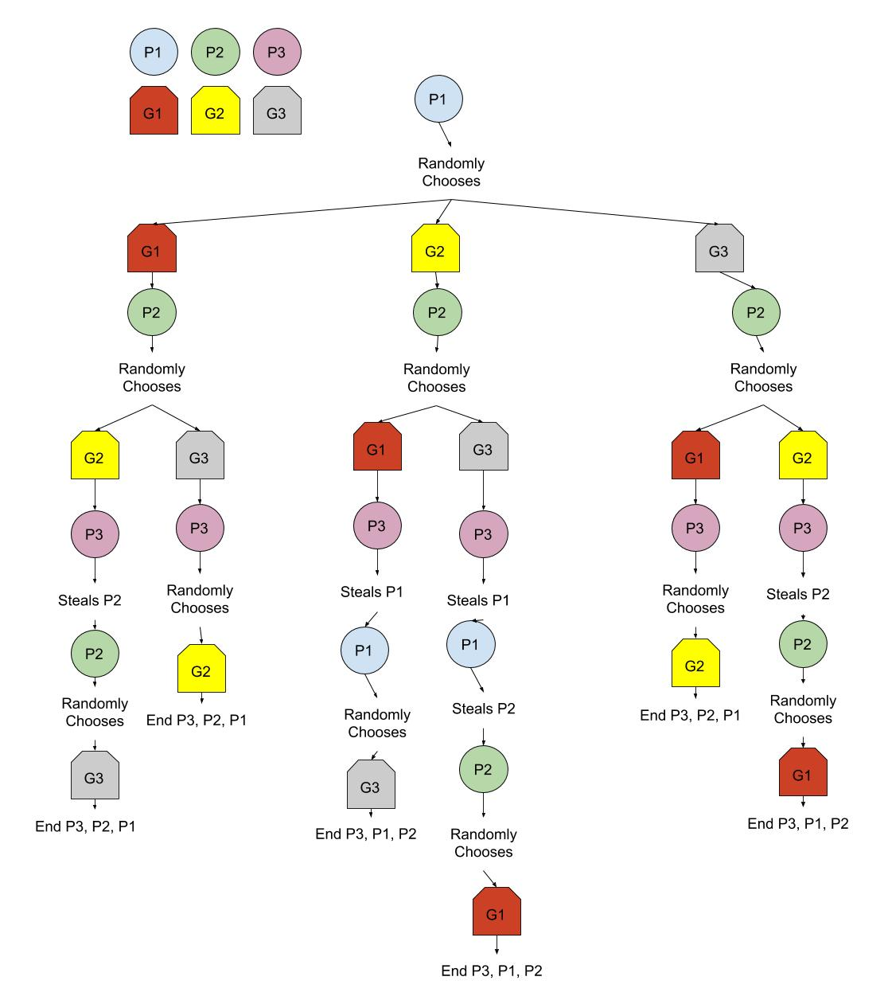
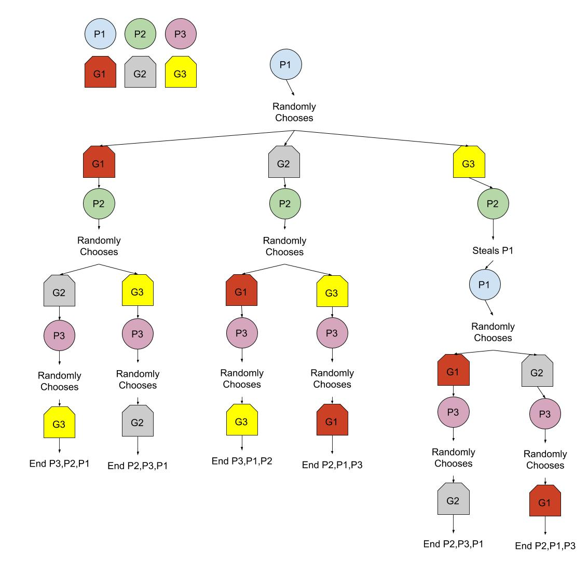

# Why White Elephant Parties Suck

## Background
I was walking with my friend around the holidays, and he mentioned that he had recently gone to a white elephant party. I learned this hot take on gift exchange goes something like this:

1. Everyone comes to the party and brings a wrapped gift.
2. All the gifts get anonymously put in a pile.
3. Players get assigned a turn order randomly.
4. Each player in order gets to choose whether they want to pick a random gift from the pile, or if they want to steal an unwrapped gift from another player.
5. If a player gets their gift stolen, it is now their turn again, but they cannot steal from someone who stole from them.
6. Each gift can only be stolen a certain amount of times, after that it is consitered safe and cannot be stolen anymore.
7. The game ends when the gift pile is empty.

The first person seems to get an unreasonably awful deal. If they pick anything of value, their gift will almost always get stolen.

## Assumptions

- Assume that presents in the pile are indistinguishable, so a participant can randomly pick their own present.
- A person will always steal a present that has greater value than the one they brought if it available to be stolen, otherwise, they will pick a present from the center.
- Since they will always steal a present that has greater value, this keeps them from stealing the present they brought.

## By Hand Analysis

Lets start with 3 people and 1 steal. We can diagram all the possible games like so:

We get the following results:
|3 people 1 steal|__Best Gift__|__Second Best Gift__|__Worst Gift__|
|:-|:-|:-|:-|
|__Participant 1__|8.3%|33.3%|58.3%|
|__Participant 2__|36.1%|36.1%|27.8%|
|__Participant 3__|55.6%|30.6%|13.9%|

As you can see, in this senerio, __Participant 3__ more that half the time gets the best gift,
and __Participant 3__ more that half the time gets the worst gift.

## Computational Analysis
Consitering that doing this by hand isn't scalable I made a program to spit out these results for me.
Here are the expected values of the getting a certain value gift based on your order position and the amount of steals allowed __WITH EXTRA SPIN__.

7 people is the max my weak computer could handle consitering this uses Omega(participants!^2) memory, which couldn't scale to 8. This brings me to my next section.

## Simulation
Since we couldn't run a complete analysis of a 100 participant game. I simulated 1000 games and averaged the expected values together.

For this simulation we will assume that the value of the present is sampled from a normal distribution with mean of 0.5 and standard deviation of 0.2.

Here is a graph of the average over 1000 games of the net value(value of the brought gift - value of recieved gift) recieved for each participant. 

## Conclusion
Don't participate in white elephant parties.
If you do, bring a really terrible gift.
If you can't, make sure you're not first to pick.

## Sources
https://arxiv.org/abs/0907.0513